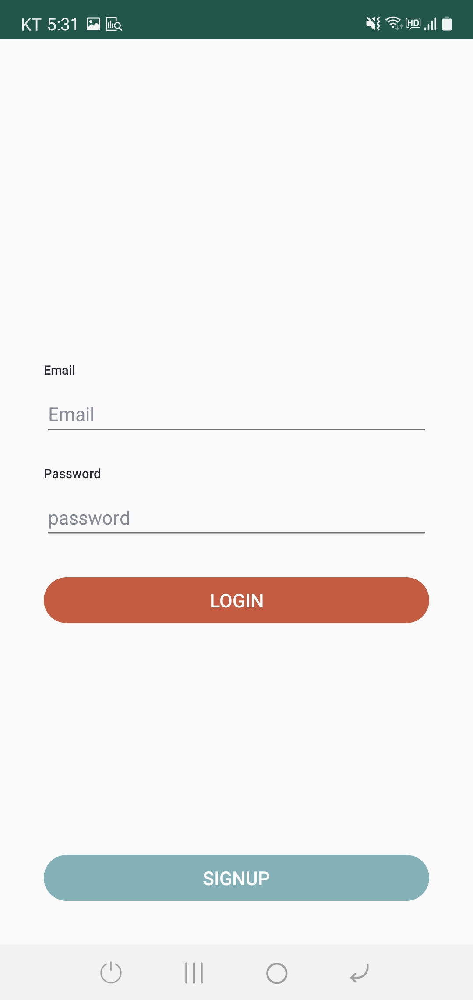
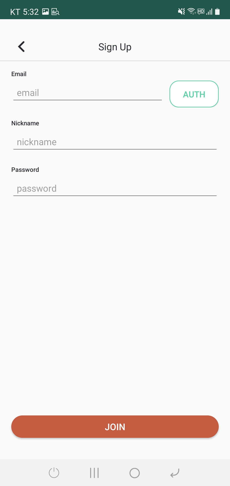
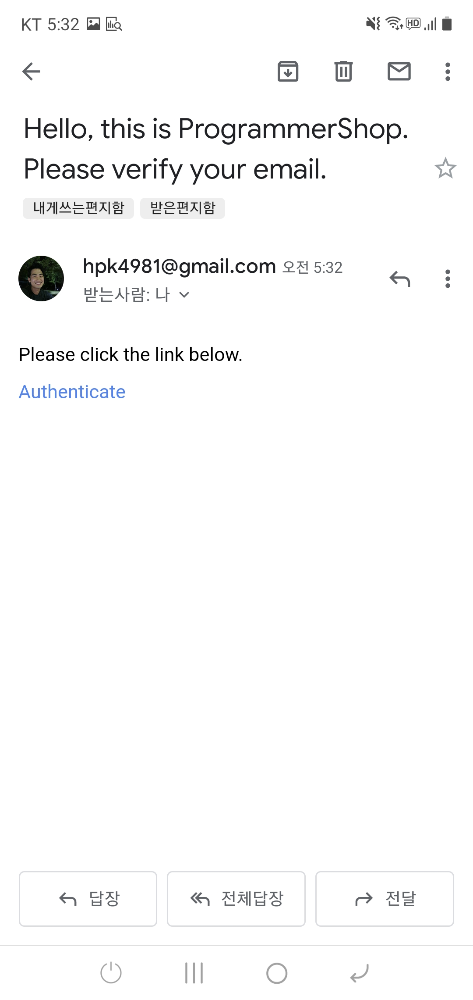
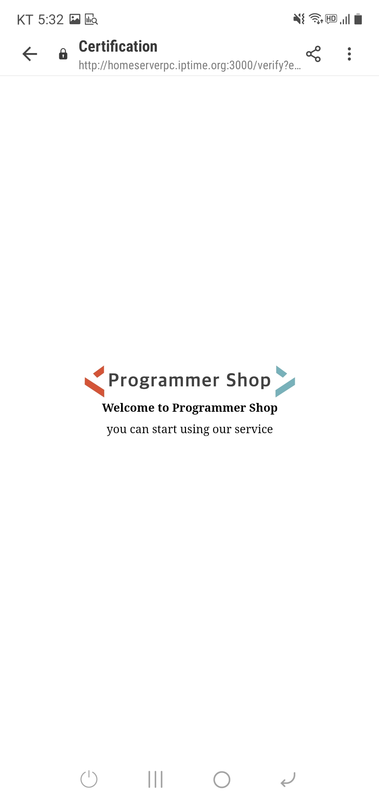
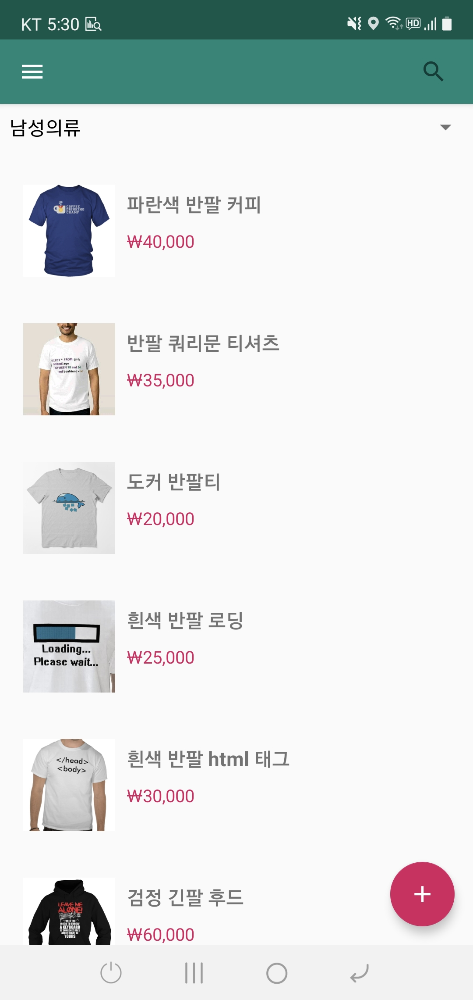
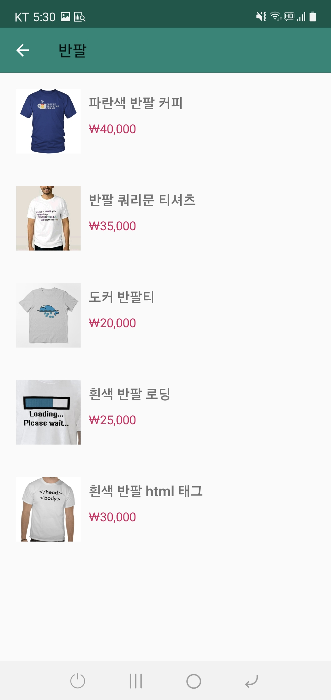
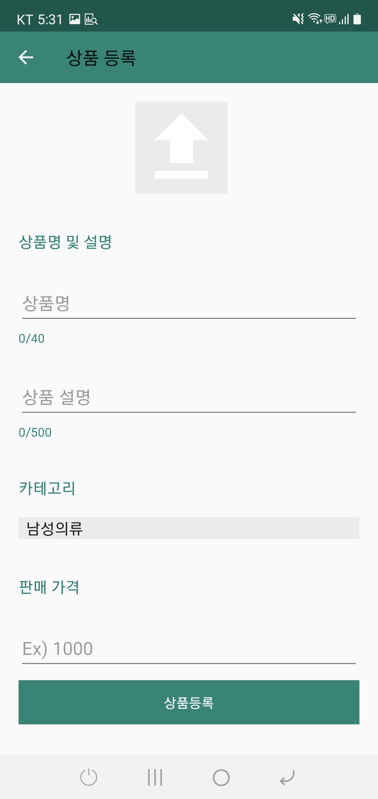

# Programmer Shop
안드로이드 기반 **Kotlin MVVM패턴으로 REST API**를 활용한 쇼핑몰 어플입니다.

---
## 스크린샷
||||
|--|--|--|
| 로딩| 로그인| 회원가입
| 이메일 인증 1| 이메일 인증 2| 상품 목록
| 상품 검색| 상품 등록| 상품 상세/수정/삭제

---
## 기능
- 이메일 인증 기반 회원가입 및 로그인
- 상품 조회 / 검색 / 등록 / 수정 / 삭제

---
## 사용 기술
- Android
    - [ViewModels](https://developer.android.com/topic/libraries/architecture/viewmodel)
    - [LiveData](https://developer.android.com/topic/libraries/architecture/livedata)
    - [ViewBinding](https://developer.android.com/topic/libraries/view-binding)
    - [Retrofit](https://github.com/square/retrofit)
    - [Glide](https://github.com/bumptech/glide)
- Server
    - [ExpressJS](https://expressjs.com)
    - [mysql2](https://github.com/sidorares/node-mysql2)
    - [body-parser](https://github.com/expressjs/body-parser)
    - [multer](https://github.com/expressjs/multer)
    - [nodemailer](https://github.com/nodemailer/nodemailer)
    - [ejs](https://github.com/mde/ejs)

---
## Routes
`GET /AllProductsGet/`
모든 상품 조회

`GET /SingleProductGet/<product_id>`
하나의 상품 조회

`POST /LoginUserCheck/`
사용자 정보 확인

`POST /EmailAuth/`
이메일 인증 요청

`POST /UserJoin/`
회원가입 요청

`POST /ProductRegistration/`
상품 등록 요청

`POST /ProductUpdate/`
상품 수정 요청

`POST /ProductDelete/`
상품 삭제 요청

---
## 라이센스
Copyright 2021 Kim Hong Pil

Licensed under the Apache License, Version 2.0 (the "License");
you may not use this file except in compliance with the License.
You may obtain a copy of the License at

    http://www.apache.org/licenses/LICENSE-2.0

Unless required by applicable law or agreed to in writing, software
distributed under the License is distributed on an "AS IS" BASIS,
WITHOUT WARRANTIES OR CONDITIONS OF ANY KIND, either express or implied.
See the License for the specific language governing permissions and
limitations under the License.